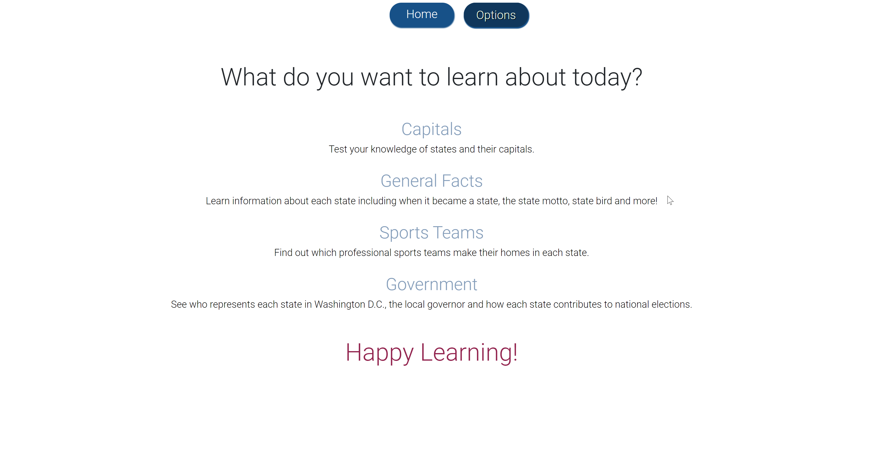
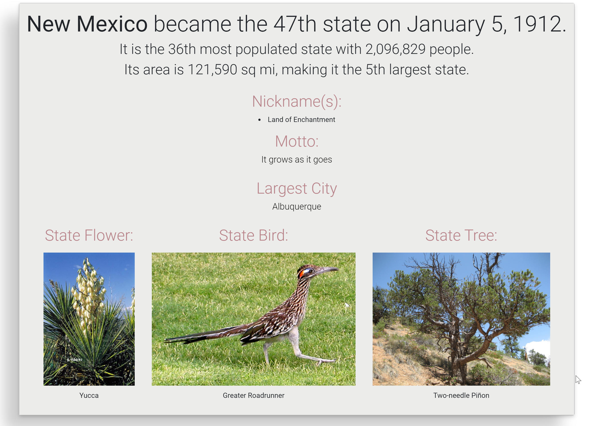

# Learn with Me USA
A learning app to build knowledge about the 50 states and Washington D.C.

[Project Walkthrough Video](https://drive.google.com/file/d/1Kb65_IWpUE36hncSFFwz8KsaxYWN9eOT/view?usp=sharing)

## Table of contents
* [General info](#general-info)
* [Screenshots](#screenshots)
* [Technologies](#technologies)
* [Setup](#setup)
* [Features](#features)
* [Status](#status)
* [Inspiration](#inspiration)
* [Contact](#contact)

## General info
More than just capitals, you can also learn about sports teams based in each state or learn about the state tree or bird of each state.  If you are interested in politics, you can see who represents each state in the Senate or House of Representatives.  All this information is right at your fingertips with Learn with Me USA!

## Screenshots
Map with Menu Options

General Card Example

## Technologies
* React
* Redux
* Thunk
* React USA Map
* React Flippy

****To see more about this process:****

[Project Blog Post](https://dev.to/meemeek/going-flippy-for-react-igm)

THANKS FOR CHECKING OUT MY PROJECT!

## Setup
* Clone this repo to your local machine `git clone <this-repo-url>`
* run `cd learn-with-me` to access
* run `npm install` to install required dependencies
* run `npm start` in your terminal and follow link to the correct port

*Also need to install Learn-API for database.*

**You can also see this project live on [Heroku](https://learn-with-me-usa.herokuapp.com/)!**

## Features
* Multiple paths to learn different information about each state.
* Includes Washington D.C. with relevant information given.
* Flip cards to test your knowledge of state capitals.
* Links to related web pages including sports team pages and state government website.

To-do list:
* An interactive feature for testing knowledge.
* A log in feature to save progress in learning.

## Status
Project is in progress.  Additional functionality still forthcoming.

## Inspiration
Project inspired by memories of using flash cards with my mom when I was younger to memorize states and capitals.  The information stuck with me and I still remember most of them today because it was something we loved doing together.  Learning is more fun with someone you love!

## Contact
Bug reports and pull requests are welcome on GitHub at https://github.com/mimirandi21/learn-with-me.
